# Parley-v2

This is a networked communication application built in Java, designed to support real-time text messaging, peer-to-peer (P2P) file transfers and video streaming between clients, and online turn based games such as Blackjack. It uses a central server for message relaying, user coordination, and peer discovery enabling direct communication between clients for media exchange.

The chat server supports multiple clients by using Java’s multithreading, with each client handled in its own thread. Messages are added to a shared, thread-safe queue and processed separately, decoupling communication and improving scalability and responsiveness.

The base of the project was a group project for CS313, however I decided to take it a step further by expanding the scope of the project, improving code quality, enhancing client/server messenging lifecycle and adding game lobbies like Blackjack.

## Features

- Username & username changing
- Chatroom
- Direct messaging
- P2P file transfers, video streams & video calls
- Game lobbies, only
- Multithreaded server
- Expandable/Adaptable codebase
  - Can expand server to support clients over different protocol (currently only tcp)
  - Integration of more game engines

## Screenshots

### Login

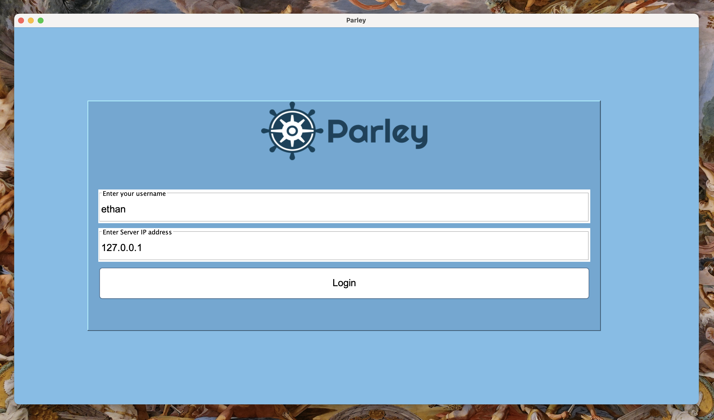

### Chatroom

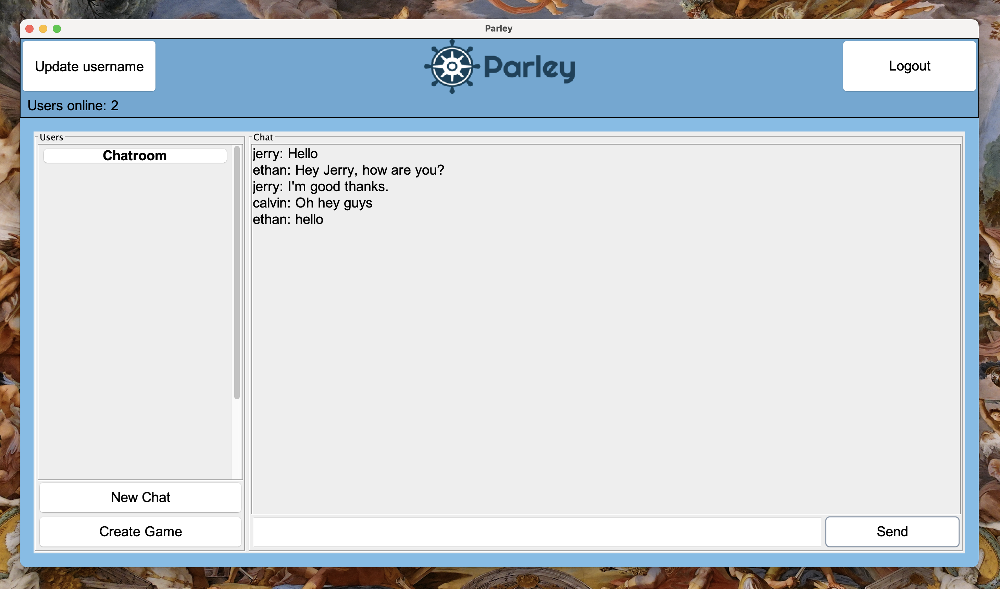

### Update username

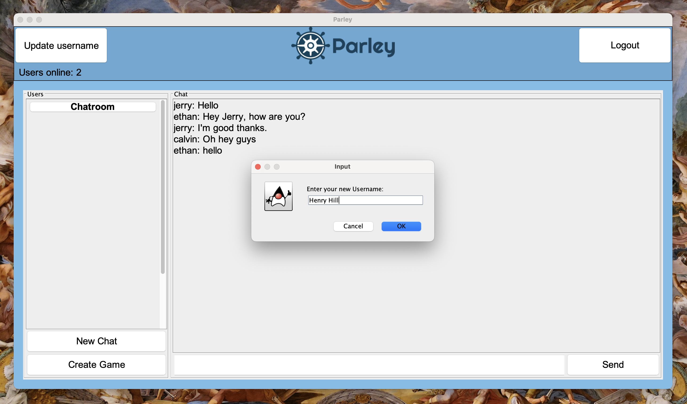

### P2P handshake

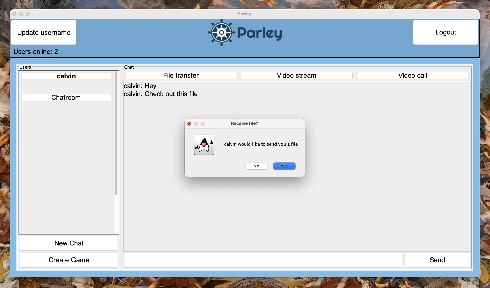

### Select file

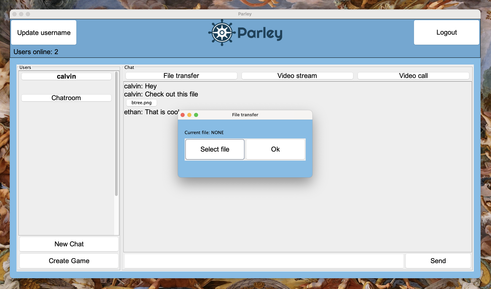

### Receive/view file

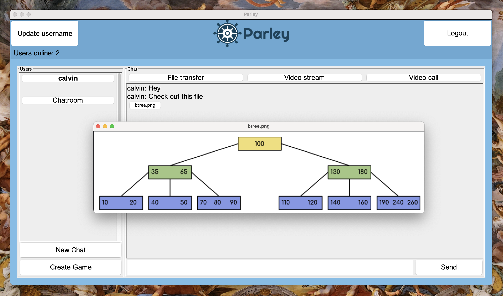

### Video file stream

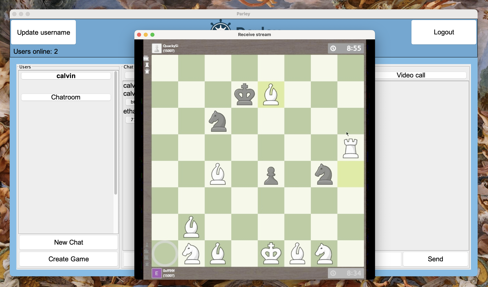

### Video call

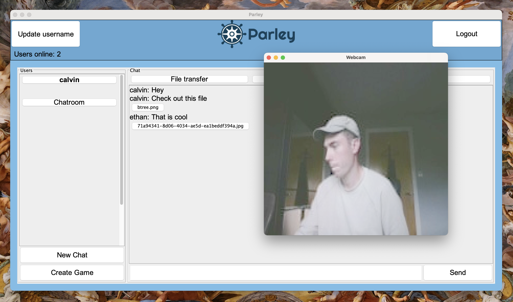

### Game picker

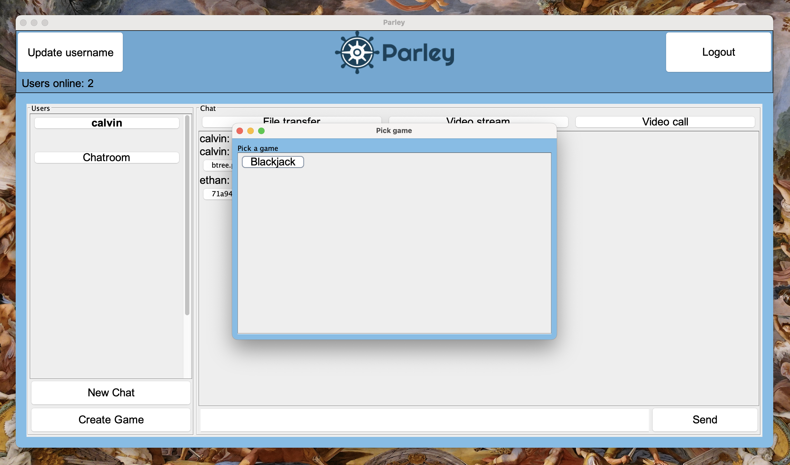

### Invite to game

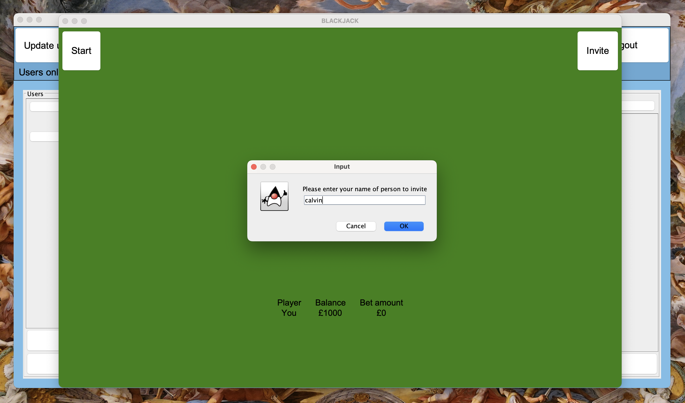

### Blackjack

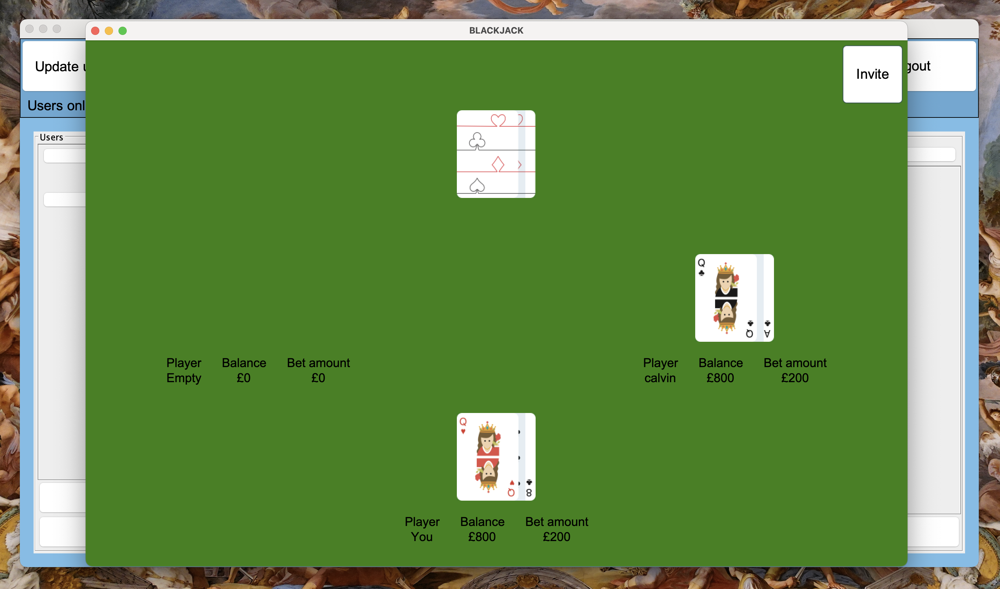

### Blackjack win

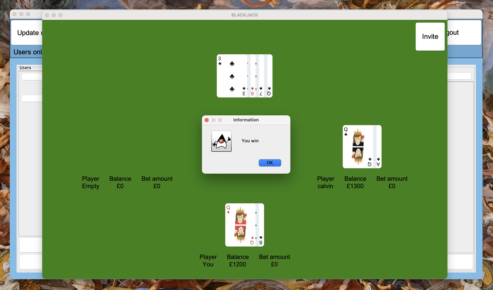

## Parley-v1 Original Contributors

- [Calum Cardownie](https://github.com/calumvc)
- [Mux Diven](https://github.com/muxdiven)
- [Fraser Patrick](https://github.com/fraserpatrick)
- Kieran Ballard
- Moray Blackwood
